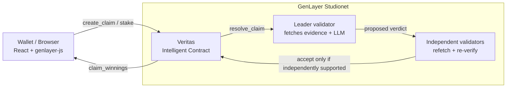

<div align="center">
  

  <p><strong>Truth, settled by consensus.</strong></p>
  <p>A trustless prediction &amp; claims market with no admins and no human oracle —<br/>
  every outcome is adjudicated entirely by GenLayer's decentralized AI-and-web validator consensus.</p>

  <p>
    <a href="https://docs.genlayer.com"></a>
    
    
    
  </p>
</div>

---

## What this is

Most "prediction markets" still need a human somewhere: an admin who resolves the market, a
committee that votes, an oracle operator who types in the answer. That human is a trust
assumption and a single point of failure.

**Veritas has no such role.** Resolution is a [GenLayer Intelligent Contract](https://docs.genlayer.com/developers/intelligent-contracts/introduction)
running [Optimistic Democracy](https://docs.genlayer.com/understand-genlayer-protocol/optimistic-democracy-how-genlayer-works)
consensus: a randomly selected leader validator fetches the claim's declared public evidence and
proposes a verdict; every other validator **independently redoes the same work** — their own
fetch, their own model call — and the verdict is only accepted once independent validators agree
it's actually supported by what they found. Disagreement simply rotates the leader and retries.



## Highlights

- **Pari-mutuel prediction market** — stake GEN on YES or NO, winners split the pool pro-rata.
- **Zero-trust resolution** — see [`contracts/veritas.py`](contracts/veritas.py): a leader/validator
  pair built on `gl.vm.run_nondet_unsafe`, with a deterministic guard that forces `UNRESOLVED`
  (full refund, no fee) whenever fewer than half the declared sources were even reachable.
- **Non-custodial settlement** — stakes live in the contract's own GenLayer balance; payouts are
  on-chain value transfers triggered by the staker, never a manual admin action.
- **No stranded funds** — a claim with no opposing side, or one nobody ever resolved in time,
  becomes voidable by anyone and refunds every position in full.
- **A frontend built to be looked at** — animated consensus visualization, glass-panel UI,
  live odds, scroll reveals, confetti on a winning claim — see [`src/styles.css`](src/styles.css).

## Tech stack

| Layer | Choice |
|---|---|
| Intelligent Contract | Python on GenVM (`contracts/veritas.py`) |
| Frontend | React 18 + Vite, plain JS/JSX (no build-time framework risk) |
| Chain SDK | [`genlayer-js`](https://docs.genlayer.com/api-references/genlayer-js) |
| Hosting | Cloudflare Pages |

No React Router, no Redux, no CSS framework, no UI kit — a hand-rolled hash router and a from-scratch
design system. Fewer moving parts, nothing to version-mismatch.

## Quickstart

```bash
git clone <this-repo>
cd veritas
npm install
npm run dev
```

You'll see a "contract not configured" banner until you deploy the Intelligent Contract and set
its address — **see [`DEPLOY.md`](DEPLOY.md) for the full walkthrough** (Studionet deploy, then
Cloudflare Pages). It takes about five minutes.

## Project structure

```
contracts/
  veritas.py            The Intelligent Contract — the entire trust model lives here
src/
  App.jsx                Hash router + centralized contract-state fetching
  lib/
    genlayer.js           Wallet connect, read/write client, transaction lifecycle
    format.js              GEN/time formatting, category metadata, payout math
  hooks/hooks.js          useReveal, useCountUp, useToasts, useWallet, useClockTick
  components/             Logo, Navbar, Footer, ClaimCard, Toasts, Visuals (orbit/particles/confetti)
  pages/                  HomePage, ClaimDetailPage, CreatePage, PortfolioPage, HowItWorksPage
public/
  config.js               Runtime network + contract address (edit post-deploy, no rebuild)
  logo-mark.svg, favicon.svg, …   Brand assets
```

## The settlement rule

```
payout = my_stake_on_winning_side × (total_pool − protocol_fee) ÷ winning_pool
```

Standard pari-mutuel math. A `VOID` claim (evidence was insufficient, or nobody ever resolved it)
skips the fee entirely and refunds every position — YES and NO alike — in full. Read the full
mechanism, with the exact leader/validator source, on the in-app **How it works** page.

## Contract surface

| Method | Description |
|---|---|
| `create_claim(title, statement, category, sources_json, closes_in_hours, resolution_window_hours)` | Open a new market |
| `stake(claim_id, side)` *(payable)* | Back YES or NO |
| `resolve_claim(claim_id)` | Permissionless — triggers validator consensus |
| `void_stale_claim(claim_id)` | Permissionless safety valve for stale/one-sided markets |
| `claim_winnings(claim_id)` | Pull your payout once resolved |
| `withdraw_treasury_fees()` | Owner-only — sweeps accrued protocol fees to the treasury address |
| `set_protocol_fee_bps(new_fee_bps)` | Owner-only — adjusts the protocol fee, capped at `MAX_FEE_BPS` |
| `get_all_claims / get_claim / get_claim_ids / get_position / get_positions_for_address / get_claim_stakers / get_dashboard_stats / get_protocol_policy` | Views |

Full docstring-level detail is in the contract itself — it's short enough to read end to end.

## License

MIT — see [LICENSE](LICENSE).

---

<div align="center">
  <sub>Built on <a href="https://www.genlayer.com">GenLayer</a> — the adjudication layer for the agentic economy.</sub>
</div>
